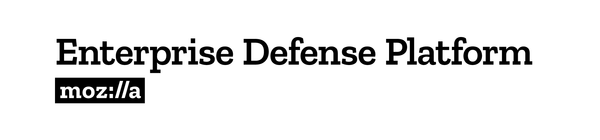

# MozDef: 

## Documentation:

https://mozdef.readthedocs.org/en/latest/

## Give MozDef a Try in AWS:

The following button will launch the Mozilla Enterprise Defense Platform in your AWS account.

**Warning:** Pressing the "Launch Stack" button and following through with the deployment will incur charges to your AWS account. 

[][1]

## Why?

The inspiration for MozDef comes from the large arsenal of tools available to attackers. Suites like metasploit, armitage, lair, dradis and others are readily available to help attackers coordinate, share intelligence and finely tune their attacks in real time. Defenders are usually limited to wikis, ticketing systems and manual tracking databases attached to the end of a Security Information Event Management (SIEM) system.

The Mozilla Enterprise Defense Platform (MozDef) seeks to automate the security incident handling process and facilitate the real-time activities of incident handlers.

## Goals:

* Provide a platform for use by defenders to rapidly discover and respond to security incidents
* Automate interfaces to other systems like bunker, cymon, mig
* Provide metrics for security events and incidents
* Facilitate real-time collaboration amongst incident handlers
* Facilitate repeatable, predictable processes for incident handling
* Go beyond traditional SIEM systems in automating incident handling, information sharing, workflow, metrics and response automation

## Status:

MozDef is in production at Mozilla where we are using it to process over 300 million events per day.

[1]: https://console.aws.amazon.com/cloudformation/home?region=us-west-2#/stacks/new?stackName=mozdef-for-aws&templateURL=https://s3-us-west-2.amazonaws.com/public.us-west-2.infosec.mozilla.org/mozdef/cf/v3.1.2/mozdef-parent.yml

## Survey & Contacting us

If you're interested in running MozDef and would like to give us feedback, please take the following surveys:

- [I have not used MozDef yet but I'm interested](https://www.surveygizmo.com/s3/5040959/MozDef-Research-Pre-Beta)
- [I have used MozDef and I have feeback!](https://www.surveygizmo.com/s3/5040962/MozDef-Research-Post-Beta)
- [Neither of these is me but I want to give general SIEM thoughts.](https://bit.ly/2KxAnDS)

These survey also include a contact form where you can reach us if you would like to (it's optional)

> **Note**: These surveys will be open for a limited amount of time, in order to ensure that we look at your feedback in
> a timely fashion. Thanks for your understanding!
