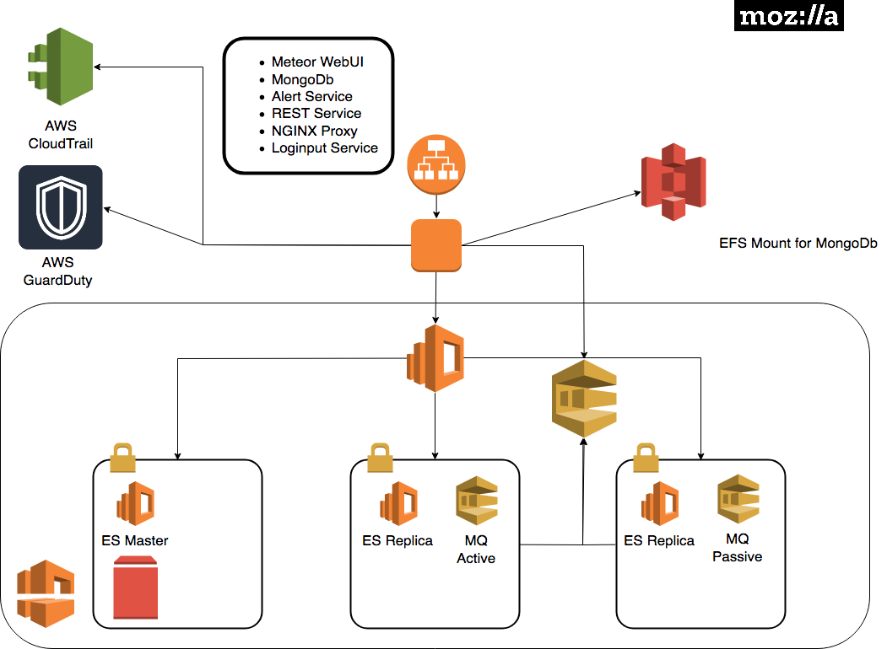

MozDef for AWS
===============

**What is MozDef for AWS**

Cloud based MozDef is an opinionated deployment of the MozDef services created in 2018 to help AWS users
ingest CloudTrail, GuardDuty, and provide security services.

.. image:: images/cloudformation-launch-stack.png
   :target: https://console.aws.amazon.com/cloudformation/home?region=us-west-2#/stacks/new?stackName=mozdef-for-aws&templateURL=https://s3-us-west-2.amazonaws.com/public.us-west-2.infosec.mozilla.org/mozdef/cf/v3.1.0/mozdef-parent.yml

Feedback
-----------

MozDef for AWS is new and we'd love your feedback.  Try filing GitHub issues here in the repository or connect with us
in the Mozilla Discourse Security Category.

https://discourse.mozilla.org/c/security

You can also take a short survey on MozDef for AWS after you have deployed it.
https://goo.gl/forms/JYjTYDK45d3JdnGd2

Dependencies
--------------

MozDef requires the following:

- A DNS name ( e.g. cloudymozdef.security.allizom.org ) which you will need to point
  at the IP address of the Application Load Balancer
- An OIDC Provider with ClientID, ClientSecret, and Discovery URL

  - Mozilla uses Auth0 but you can use any OIDC provider you like: Shibboleth,
    KeyCloak, AWS Cognito, Okta, Ping (etc.).
  - You will need to configure the redirect URI of ``/redirect_uri`` as allowed in
    your OIDC provider configuration.
- An ACM Certificate in the deployment region for your DNS name
- A VPC with three public subnets available

  - It is advised that this VPC be dedicated to MozDef or used solely for security automation.
  - The three public subnets must all be in different `availability zones <https://docs.aws.amazon.com/AWSEC2/latest/UserGuide/using-regions-availability-zones.html#using-regions-availability-zones-describe>`_
    and have a large enough number of IP addresses to accommodate the infrastructure.
  - The VPC must have an `internet gateway <https://docs.aws.amazon.com/vpc/latest/userguide/VPC_Internet_Gateway.html>`_
    enabled on it so that MozDef can reach the internet.
- An SQS queue receiving GuardDuty events
  - At the time of writing this is not required but may be required in future.

Supported Regions
------------------

MozDef for AWS is currently only supported in us-west-2 but additional regions will be added over time.

Architecture
-------------

Deployment Process
-------------------

1. Launch the one click stack and provide the requisite values.
2. Wait for the stack to complete.  You'll see several nested stacks in the
   CloudFormation console. Once the EC2 instance is running there are still
   provisioning steps taking place on the instance. *Note: This may take a while*
3. Configure your DNS name to point to the application load balancer
4. Navigate to the URL you set up for MozDef.  It should redirect you to the
   single sign on provider.  If successful you'll see the MozDef UI.
5. Try navigating to ElasticSearch https://your_base_url:9090

You should see the following:
::

    {
      "name" : "SMf4400",
      "cluster_name" : "656532927350:mozdef-mozdef-yemjpbnpw8xb",
      "cluster_uuid" : "_yBEIsFkQH-nEZfrFgj7mg",
      "version" : {
        "number" : "5.6.8",
        "build_hash" : "688ecce",
        "build_date" : "2018-09-11T14:44:40.463Z",
        "build_snapshot" : false,
        "lucene_version" : "6.6.1"
      },
      "tagline" : "You Know, for Search"
    }

5. Test out Kibana at https://your_base_url:9090/_plugin/kibana/app/kibana#/discover?_g=()

Troubleshooting
---------------

To view logs on the ec2 instance

1. Determine the name/IP of the autoscaled EC2 instance via the command line or web console
2. SSH into that EC2 instance as the ``ec2-user`` user using the SSH keypair that you
   set as the ``KeyName`` parameter in CloudFormation
3. List out all the containers with
   ::

     sudo docker container ls
4. Tail logs from the container you'd like to examine with
   ::

     # show both the access logs and the error logs
     sudo docker logs --follow NAME_OF_CONTAINER
     # show only the error logs
     docker logs --follow NAME_OF_CONTAINER >/dev/null

   where ``NAME_OF_CONTAINER`` is the container name or ID that you found in the
   step above
5. To enter the environment for that container run
   ::

     sudo docker exec --interactive --tty NAME_OF_CONTAINER /bin/bash
6. To view the environment variables being made available to the containers view
   the file ``/opt/mozdef/docker/compose/cloudy_mozdef.env``

Using MozDef
-------------

Refer back to our other docs on how to use MozDef for general guidance.  Cloud specific instructions will evolve here.
If you saw something about MozDef for AWS at re: Invent 2018 and you want to contribute we'd love your PRs.
