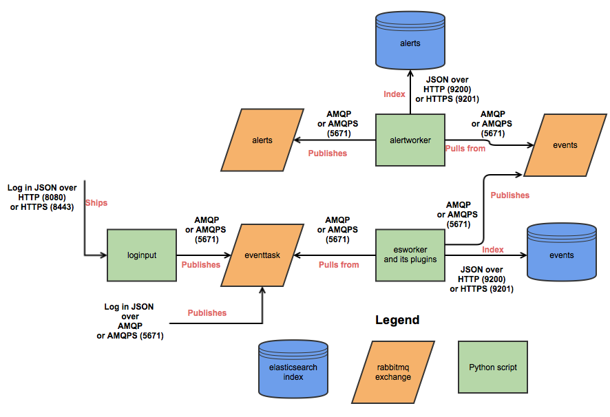

Overview
========
What?
-----
It's easiest to describe The Mozilla Defense Platform (MozDef) as a set of micro-services you can use as an open source Security Information and Event Management (SIEM) overlay on top of Elasticsearch.

Why?
----

The inspiration for MozDef comes from the large arsenal of tools available to attackers.
Open source suites like metasploit, armitage, lair, dradis and others are readily available to help attackers coordinate, share intelligence and finely tune their attacks in real time.

Open source options for defenders are usually limited to wikis, ticketing systems and manual tracking databases attached to the end of a commercial SIEM.

The Mozilla Defense Platform (MozDef) seeks to automate the security incident handling process and facilitate the real-time activities of incident handlers.

Goals
-----

High level
**********

* Provide a platform for use by defenders to rapidly discover and respond to security incidents
* Automate interfaces to other systems like firewalls, cloud protections and anything that has an API
* Provide metrics for security events and incidents
* Facilitate real-time collaboration amongst incident handlers
* Facilitate repeatable, predictable processes for incident handling
* Go beyond traditional SIEM systems in automating incident handling, information sharing, workflow, metrics and response automation

Technical
*********

* Offer micro services that make up an Open Source Security Information and Event Management (SIEM)
* Scalable, should be able to handle thousands of events per second, provide fast searching, alerting, correlation and handle interactions between teams of incident handlers

MozDef aims to provide traditional SIEM functionality including:

* Accepting events/logs from a variety of systems.
* Storing events/logs.
* Facilitating searches.
* Facilitating alerting.
* Facilitating log management (archiving,restoration).

It is non-traditional in that it:

* Accepts only JSON input.
* Provides you open access to your data.
* Integrates with a variety of log shippers including logstash, beaver, nxlog, syslog-ng and any shipper that can send JSON to either rabbit-mq or an HTTP(s) endpoint.
* Provides easy integration to Cloud-based data sources such as CloudTrail or GuardDuty.
* Provides easy python plugins to manipulate your data in transit.
* Provides extensive plug-in opportunities to customize your event enrichment stream, your alert workflow, etc.
* Provides realtime access to teams of incident responders to allow each other to see their work simultaneously.

Architecture
------------
MozDef is based on open source technologies including:

* Nginx (http(s)-based log input)
* RabbitMQ (message queue and amqp(s)-based log input)
* uWSGI (supervisory control of python-based workers)
* bottle.py (simple python interface for web request handling)
* Elasticsearch (scalable indexing and searching of JSON documents)
* Meteor (responsive framework for Node.js enabling real-time data sharing)
* MongoDB (scalable data store, tightly integrated to Meteor)
* VERIS from verizon (open source taxonomy of security incident categorizations)
* d3 (javascript library for data driven documents)
* Firefox (a snappy little web browser)

Frontend processing
*******************

Frontend processing for MozDef consists of receiving an event/log (in json) over HTTP(S), AMQP(S), or SQS
doing data transformation including normalization, adding metadata, etc. and pushing
the data to Elasticsearch.

Internally MozDef uses RabbitMQ to queue events that are still to be processed.
The diagram below shows the interactions between the python scripts (controlled by uWSGI),
the RabbitMQ exchanges and Elasticsearch indices.

Status
------

MozDef has been in production at Mozilla since 2014 where we are using it to process over 300 million events per day.
