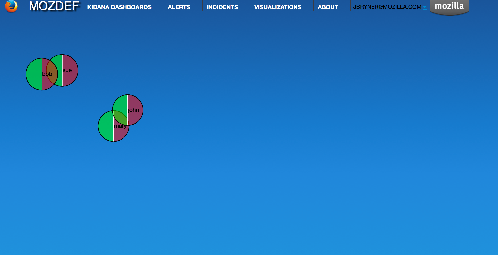
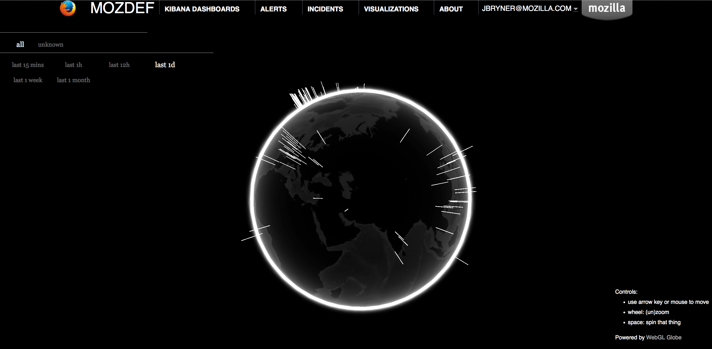
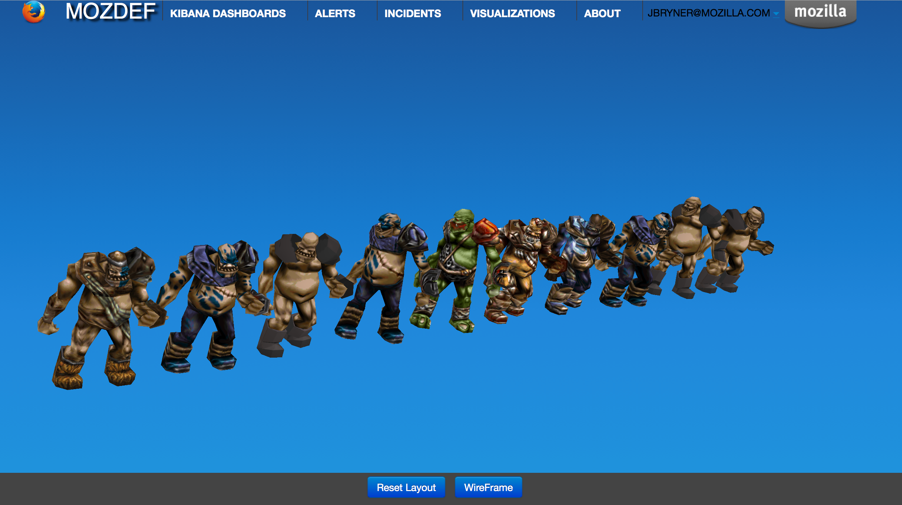

Screenshots
==========

Here are a few screen captures of key portions of the MozDef user interface.

Health and Status
-----------------
MozDef includes an integrated health and status screen under the 'about' menu showing key performance indicators like events per second from rabbit-mq and elastic search cluster health. 

You can have as many front-end processors running rabbit-mq as you like in whatever geographic distribution makes sense for your environment. The hot threads section shows you what your individual elastic search nodes are up to.

The entire display updates in real time as new information is retrieved.

.. image:: images/HealthAndStatus.png

Alerts
------
Alerts are simply python jobs run as celery tasks that query elastic search for either individual events, or correlate
multiple events into an alert. 

The alerts screen shows the latest 100 alerts and allows interactive filtering by category, severity, time frame and free-form regex.

The display updates in real time as new alerts are received and any IP address in an alert is decorated with a menu allowing
you to query whois, dshield, CIF, etc to get context on the item. If your facilities include blocking, you can also 
integrate that into the menu to allow you to block an IP directly from this screen. 

.. image:: images/Alerts.png

Incident Handling
-----------------
MozDef includes an integrated, real time incident handling facility that allows multiple responders to work collaboratively
on a security incident. As they add information to the incident they are able to see each others changes as they happen, in real time. 

MozDef includes integration into the VERIS classification system to quickly tag incidents with metadata by dragging tags onto
the incident which allows you to aggregate metrics about your incidents.

.. image:: images/IncidentHandling.png

d3 visualizations
-----------------
The d3.js library is included in MozDef to allow you custom visualizations of your data. The is a sample
visualization of login counts (success vs failed) that you can integrate into your central authentication directory
for quick context into user activity.

Geo location of Attackers
-------------------------
MozDef includes the WebGL globe as a three.js visualization that geolocates attackers to give you quick, interactive context about
threat actors. 

3D interactive Attacker visualization
-------------------------------------
MozDef correlates alerts and events into a 3D visual representation of attackers as ogres. You can use this
to quickly filter attackers by category or timeframe and get easy access to recent alerts and events from attackers in 3D.

Demo Instance
=============

Mozilla maintains a demo instance of MozDef that you can use try out the UI and get a feel for it in a live environment
with test/random data. 

Simply browse to http://demo.mozdef.com:3000 and login using any gmail or yahoo email address. No credentials/passwords are
sent to the demo instance, though your email will be logged. If you'd prefer you can also use mozdef@mockmyid.com as a userID which will not prompt for any credentials.
